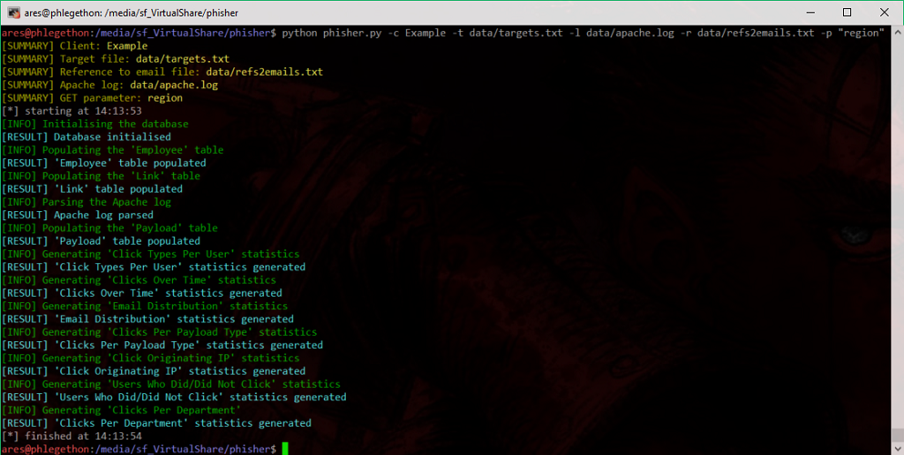
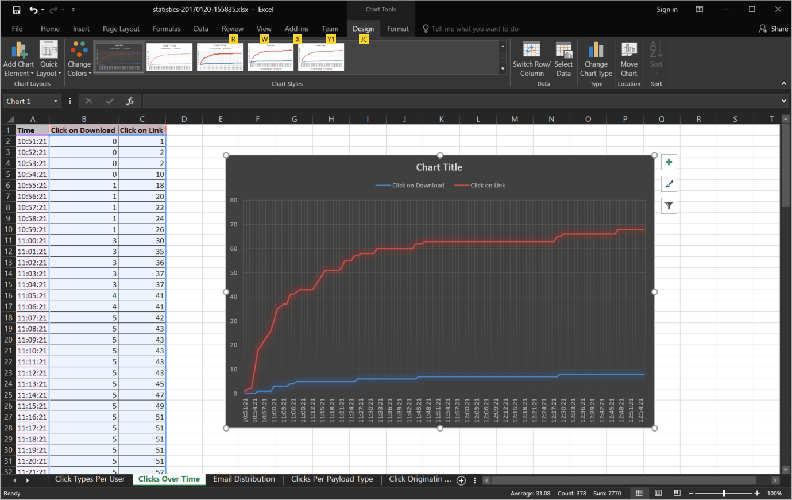

# phishstat
## Automating the generation of statistics obtained from Phishing engagements.

This script structures the results obtained from Phishing engagements into a MySQL database and generates different types of statistics.



The database model used is as follows:
* **Employee**: Holds information about the targetted `Employee` 
  * `client`
  * `email`
  * `role`

* **Link**: Intermediate table linking an `Employee` to a `Payload`
  * `ref`
  * `email`

* **Payload**: Holds information about the delivered `Payload` 
  * `idP`
  * `type`
  * `host`
  * `agent`
  * `date`
  * `ref`

The statistics are all generated into individual worksheets within a single `.xlsx` file, as shown in the following screenshot.
 


The following statistics are currently implemented:
* `Click Types Per User`
* `Clicks Over Time`
* `Email Distribution`
* `Clicks Per Payload Type`
* `Click Originating IP`
* `Users Who Did/Did Not Click`
* `Clicks Per Department`

## Installation
```
$ git clone https://github.com/AresS31/phishstat
$ cd phishstat
# pip install -r requirements.txt
```
The `MYSQL_USER` and `MYSQL_PASSWORD` global variable must be edited  within the script (line 34 and 35).

### Usage
```
$ python phishstat.py [-h] -c CLIENT -l APACHE_LOG -p PARAMETER -r EMAIL2REF -t
                    TARGET [-v]

-h, --help            show this help message and exit
-c CLIENT, --client CLIENT
                      name for the database storing the engagement results
-l APACHE_LOG, --log APACHE_LOG
                      Apache log file
-p PARAMETER, --parameter PARAMETER
                      GET parametereter used to identify each clicks
-r EMAIL2REF, --ref EMAIL2REF
                      file containing the email to reference
-t TARGET, --target TARGET
                      file containg the target details
-v, --verbose         enable verbose mode
```
##### Apache log example:
```
11.22.33.44 - - [25/Oct/2016:10:51:21 +0100] "GET /phishing.gov.uk?region=KT4-EAC82 HTTP/1.1" 301 577 "-" "Mozilla/5.0 (Windows NT 10.0; WOW64; Trident/7.0; Touch; rv:11.0) like Gecko"
11.22.33.44 - - [25/Oct/2016:10:51:22 +0100] "GET /phishing.gov.uk/?region=KT4-BDCB5 HTTP/1.1" 200 22729 "-" "Mozilla/5.0 (Windows NT 10.0; WOW64; Trident/7.0; Touch; rv:11.0) like Gecko"
11.22.33.44 - - [25/Oct/2016:10:53:36 +0100] "GET /phishing.gov.uk?region=KT4-C2AE6 HTTP/1.1" 301 577 "-" "Mozilla/5.0 (Windows NT 6.1; WOW64; Trident/7.0; rv:11.0) like Gecko"
11.22.33.44 - - [25/Oct/2016:10:53:36 +0100] "GET /phishing.gov.uk/?region=KT4-30747 HTTP/1.1" 200 22729 "-" "Mozilla/5.0 (Windows NT 6.1; WOW64; Trident/7.0; rv:11.0) like Gecko"
11.22.33.44 - - [25/Oct/2016:10:53:36 +0100] "GET /phishing.gov.uk/?region=KT4-779D8 HTTP/1.1" 200 22729 "-" "Mozilla/5.0 (Windows NT 6.1; WOW64; Trident/7.0; rv:11.0) like Gecko"         
```

*Note*: The GET parameter (-p, --param) used to parse the results in the above example is `region`.

##### Target file expected formatting:
```
aaaaa@mailserver.co.uk,Director
bbbb@mailserver.co.uk,Technical
cccc@mailserver.co.uk,Support
dddd@mailserver.co.uk,Sale
eeee@mailserver.co.uk,Other
```

##### Email to reference file expected formatting:
```
aaaaaa@mailserver.co.uk,KT4-EAC82
bbbbbb@mailserver.co.uk,KT4-BDCB5
cccccc@mailserver.co.uk,KT4-C2AE6
dddddd@mailserver.co.uk,KT4-30747
eeeeee@mailserver.co.uk,KT4-779D8
```

## Possible Improvements
- [ ] Add new features.
- [ ] Source code optimisation.

## License
Copyright (C) 2017 - 2018 Alexandre Teyar

Licensed under the Apache License, Version 2.0 (the "License");
you may not use this file except in compliance with the License.
You may obtain a copy of the License at

<http://www.apache.org/licenses/LICENSE-2.0>

Unless required by applicable law or agreed to in writing, software
distributed under the License is distributed on an "AS IS" BASIS,
WITHOUT WARRANTIES OR CONDITIONS OF ANY KIND, either express or implied.
See the License for the specific language governing permissions and
limitations under the License.
